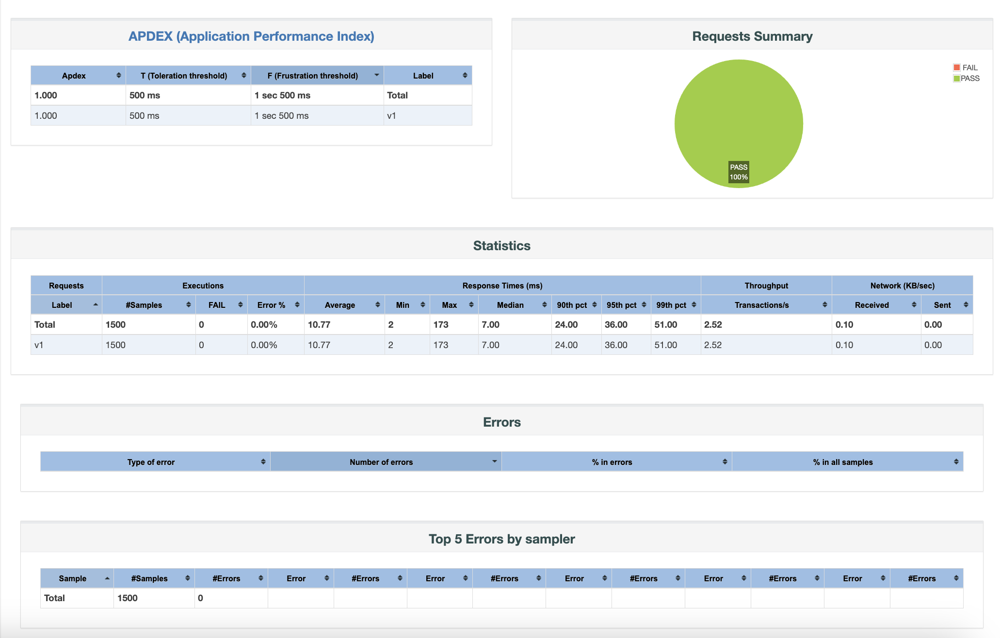

# «Отчет о нагрузочном тестировании добавления комментариев на WordPress через прямые запросы к базе данных»
#### Отчет тестировщика о состоянии проекта 
  * [Цель тестирования](README.md#Цель-тестирования) 
  * [Конфигурация тестового стенда](README.md#Конфигурация-тестового-стенда) 
  * [Сценарий тестирования](README.md#Сценарий-тестирования) 
  * [Графики](README.md#графики) 
  * [Результаты](README.md#Результаты)
  * [Найденные в процессе дефекты](README.md#найденные-в-процессе-дефекты) 
  * [Трудоемкость](README.md#трудоемкость) 
  * [Календарная длительность](README.md#календарная-длительность)
  * [Выводы](README.md#выводы) 

 
 
## Отчет тестировщика о состоянии проекта
**ФИО:** Волков Лев Александрович

**Дата:** 10 ноября 2024

**Название проекта:** Добавление комментария на странице WordPress 

**ID заявки на тестирование:**  123456

**ID фичи:** 78910

**Номер версии релизной сборки:** 1.0.0

 

## Цель тестирования
Целью данного тестирования является подтверждение заявленной производительности WordPress увеличении количества пользователей, отправляющих запросы на страницу добавления комментария непосредственно из базы данных. Основное внимание уделяется оценке эффективности обработки таких запросов системой, а также определению максимальной производительности WordPress в условиях высокой нагрузки.

Основные требования включают:
  * Общее колличество комментариев 1 500.
  * Поддержка до 150 пользователей которые добавляются постепенно в течении 10 минут.
  * Колличество итераций для каждого пользователя 10.
  * Время добавления комментария не более 2 секунд.
  * Обработка транзакций с временем выполнения не более 3 секунд.
  * Стабильное функционирование сайта без сбоев или ошибок.

 

## Конфигурация тестового стенда
  * **Серверы:** 1 сервер
  * **Ядра процессора:** 10 ядер 
  * **Память:** 16 GB RAM 
  * **Операционная система:** macOS Sequoia 15.1
  * **Вспомогательное ПО:** Docker, DBeaver, MariaDB, JMeter, Grafana, CI/CD Jenkins

 

## Сценарий тестирования
Тестирование системы было выполнено с использованием JMeter для симуляции нагрузки. В рамках этого сценария были реализованы следующие шаги:
#### 1. Настройка окружения:
  * Создание контейнеров с использованием Docker для изолированного выполнения всех необходимых компонентов.
  * Автоматизация процессов CI/CD: Использование Jenkins для автоматизации сборки, тестирования и развертывания проекта, что позволило ускорить процесс и снизить количество ошибок, связанных с ручными действиями.
#### 2. Запуск сайта:
  * Установка и конфигурация сайта WordPress, а затем проверка его доступности.
#### 3. Добавление комментариев:
  * Через интерфейс сайта: Комментарии добавлялись вручную через пользовательский интерфейс для проверки функциональности.
  * Напрямую через базу данных: Использование хранимых процедур для автоматического добавления комментариев в базу данных, что позволяет оценить поведение системы при записи данных без пользовательского интерфейса. 
#### 4. Нагрузочные тесты:
  * Проведение нагрузочных тестов с использованием JMeter, имитирующих одновременные добавления комментариев, чтобы определить, как система справляется с высокой нагрузкой.
#### 5. Отчетность:
  * Сбор и визуализация данных с помощью Grafana, подключенной к базе данных InfluxDB, а также создание отчетов по результатам тестирования. и Dashboard Apache Jemeter отчет.

 

## Графики
⬇️ Метрики хоста:

⬇️ Результаты нагрузки

 

## Результаты
  * Система демонстрирует высокую эффективность, обрабатывая 1500 комментариев:
    * Среднее время отклика (Average): 10.77 мс
    * Минимальное время отклика (Min): 2 мс
    * Максимальное время отклика (Max): 173 мс
    * Медианное время отклика (Median): 7.00 мс
    * 90-й процентиль (90th pct): 36 мс (в 90% случаев время отклика было не больше 36 мс)
    * 95-й процентиль (95th pct): 36 мс (похожие данные на 90-й процентиль)
    * 99-й процентиль (99th pct): 51 мс
  * Система справилась с нагрузкой страницы сайта.
  
 

## Найденные в процессе дефекты
1. **New:**
  * Проблема с загрузкой страницы комментариев при нагрузке более 5000 пользователей одновременно.
Описание: При одновременном обращении к странице комментариев более 5000 пользователей система демонстрирует существенные задержки в загрузке, что указывает на необходимость оптимизации производительности.

2. **In Progress:**
  * Некоторые комментарии не отображаются из-за проблем с кэшированием.
Описание: В ходе тестирования выявлено, что часть комментариев не отображается на странице из-за неполадок в системе кэширования. Решение проблемы требует дополнительного анализа логики кэширования.

3. **Reopened:**
  * Проблема с завершением транзакции под высокой нагрузкой.
Описание: Данная проблема была повторно открыта, так как при увеличении нагрузки на систему возникли конфликты, приводящие к неправильному завершению транзакций. Требуется дальнейшее исследование для устранения данной неисправности.

 

## Трудоемкость
**Фамилия, Кол-во дней:**  
Волков, 3

 

## Календарная длительность
Заявка выполнена за 3 календарных дней.

 

## Выводы
1. **Существующие проблемы:** В процессе тестирования была выявлена проблема с загрузкой страницы комментариев при нагрузке более 5000 пользователей одновременно. Это может указывать на необходимость оптимизации работы с базой данных или внедрения более эффективных механизмов кэширования, чтобы улучшить производительность при высокой нагрузке.
2. **Опасения:** В процессе тестирования была выявлена проблема с загрузкой страницы комментариев при нагрузке более 5000 пользователей одновременно. Это может указывать на необходимость оптимизации работы с базой данных или внедрения более эффективных механизмов кэширования, чтобы улучшить производительность при высокой нагрузке. 
3. **Предложения:**
  * Оптимизация базы данных:
    * Рассмотреть возможность оптимизации запросов к базе данных, чтобы улучшить производительность и снизить время отклика при большом количестве одновременных запросов.
  * Улучшение механизма кэширования:
    * Рекомендуется внедрить более эффективные системы кэширования, что поможет уменьшить время загрузки страницы, особенно при увеличении числа пользователей.
  * Постоянный мониторинг:
    * Важно продолжать мониторинг производительности системы и внедрить автоматизированные системы оповещения при возникновении проблем с доступностью.
  * Регулярные тестирования:
    * Настоятельно рекомендуется проводить регулярные нагрузочные тесты после внедрения изменений, чтобы обеспечить соответствие заявленной производительности и фактической реакции системы.
<h3>
 ✅ Заявленная производительность подтверждена, система обеспечивает   такую производительность.
</h3>

